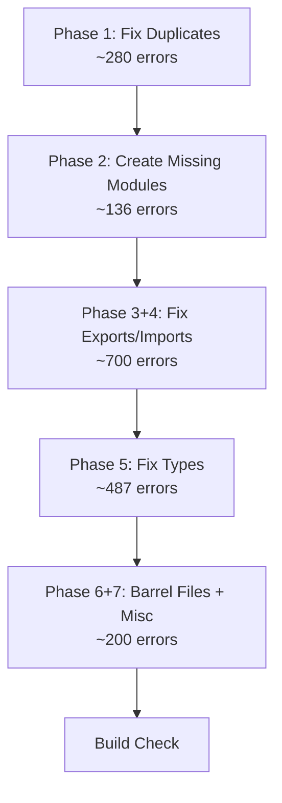

# Systematic Build Error Fix Plan — InfiniGen R3F

## Problem Summary

The project has **1,924 TypeScript errors** across **~130 files**. After deep analysis of the build output and source code, I've identified **7 root cause categories** that can be addressed systematically using scripted fixes.

## Error Distribution by Subsystem

| Subsystem | Errors | % of Total |
|-----------|--------|------------|
| `core/nodes/` | 831 | 43% |
| `core/constraints/` | 413 | 21% |
| `assets/objects/` | 153 | 8% |
| `datagen/pipeline/` | 56 | 3% |
| `core/placement/` | 55 | 3% |
| `ui/components/` | 54 | 3% |
| Other (terrain, editor, integration, etc.) | 362 | 19% |

## Root Cause Analysis & Fix Strategy

### Phase 1: Duplicate Declarations (TS2300 + TS2484 + TS2323 + TS2308 — ~280 errors)

**Root Cause**: Files define classes/types inline AND re-export them at the bottom (e.g., `export class Foo {...}` then later `export { Foo }`). Also, enums have duplicate members (e.g., `TEXTURE` appears twice in `NodeCategory`, `ObjectInfo` duplicated in `NodeType`, `ColorRamp`/`CombineHSV` duplicated).

**Fix Strategy**: 
1. **Remove redundant re-export blocks** at bottom of files (CameraNodes.ts, CollectionNodes.ts, VolumeNodes.ts, ColorNodes.ts, SimulationNodes.ts, etc.)
2. **Fix duplicate enum values** in `core/nodes/core/types.ts` — rename `TEXTURE = 'TEXTURE_SHADER'` → `TEXTURE_SHADER`, and remove duplicate `ObjectInfo`, `ColorRamp`, `CombineHSV` entries
3. **Fix re-export conflicts** in barrel index files (core/index.ts, constraints/index.ts, objects/index.ts, etc.)

> [!IMPORTANT]
> This phase alone will eliminate ~280 errors and unblock many downstream issues. Most fixes are scriptable patterns.

---

### Phase 2: Missing Module Imports (TS2307 — 136 errors)

**Root Cause**: Files import from modules that don't exist. These fall into categories:
- **Missing internal modules**: `../core/node-types`, `../core/socket-types`, `../../language/types.js`, `./FloorPlanMoves`, `./SphericalMesher`, etc.
- **Missing external packages**: `@react-three/drei`, `@react-three/fiber`, `@react-three/postprocessing`, `@react-three/rapier`, `recharts`
- **Wrong import paths** with `.js` extensions: `./core/index.js`, `./moves/index.js`, etc.

**Fix Strategy**:
1. **Create stub modules** for truly missing internal modules (about 40 unique modules needed)
2. **Install missing npm packages** or add them as devDependencies with type stubs
3. **Fix .js extension imports** → remove `.js` suffixes or add proper barrel files

---

### Phase 3: Property Does Not Exist (TS2339 — 537 errors, largest category)

**Root Cause**: Classes reference properties/methods that aren't defined on their type, OR access the wrong property names. Key patterns:
- Node classes reference `NodeTypes.Xxx` but `NodeTypes` is imported from `../core/node-types` which doesn't exist (chain from Phase 2)
- Classes implementing interfaces miss required properties (`name`, `settings`, `domain`, etc.)
- Three.js API mismatches (e.g., `Camera.focal` doesn't exist on base `Camera`)

**Fix Strategy**:
1. Many resolve automatically after Phase 2 (missing modules cause cascading TS2339)
2. Add missing properties to classes or fix interface implementations
3. Fix Three.js API calls to use correct properties

---

### Phase 4: Module Has No Exported Member (TS2305 — 159 errors)

**Root Cause**: Import statements reference named exports that don't exist in the target module. Key patterns:
- `GeometryDataType` imported from `socket-types` (doesn't exist → should be `SocketType`)
- `GeometryType` imported from `types` (not exported)
- Various `Config` types not exported from their files

**Fix Strategy**: 
1. Add missing exports to source modules
2. Fix import names to use actual exported names
3. Create missing type aliases

---

### Phase 5: Type Mismatches (TS2345, TS2322, TS2352, TS2315, TS2740 — ~487 errors)

**Root Cause**: 
- `NodeDefinition` used as generic (`NodeDefinition<T>`) but it's not generic — need to make it generic or remove type params
- `NodeSocket` type requires `required` field but inline definitions don't include it → cast needed
- Various `as NodeSocket[]` casts fail because inline objects don't match the interface shape

**Fix Strategy**:
1. Make `NodeDefinition` generic OR remove all generic type parameters from usage
2. Make `NodeSocket` fields optional (`required?`, `defaultValue?`) so inline definitions match
3. Fix type assertion patterns

---

### Phase 6: Missing Exported Members in Barrel Files (TS2614, TS2308 — ~100 errors)

**Root Cause**: Index/barrel files re-export from sub-modules but:
- Use named imports `{ X }` when the sub-module uses `export default`
- Multiple sub-modules export the same name, causing conflicts

**Fix Strategy**:
1. Fix default vs named export mismatches
2. Use explicit re-exports to resolve name conflicts

---

### Phase 7: Miscellaneous (TS2416, TS2654, TS2551, TS2532 — ~100 errors)

Remaining errors: incorrect overrides, unused variables with errors, typos in property names, null checks needed.

## Proposed Execution Order



## Detailed Phase 1 Execution

### Step 1.1: Fix `core/nodes/core/types.ts` duplicate enum values

Remove duplicate entries in `NodeCategory` and `NodeType` enums:
- `NodeCategory.TEXTURE` duplicated (line 77 and 85)
- `NodeType.ColorRamp` duplicated (line 117, 279)  
- `NodeType.CombineHSV` duplicated (line 122, 277)
- `NodeType.ObjectInfo` duplicated (line 173, 305)
- `NodeType.StoreNamedAttribute` → `StoreNamedAttribute` duplicated in `node-types.ts`

### Step 1.2: Remove redundant re-export blocks from node files

Files with the pattern of `export class X` + later `export { X }`:
- `core/nodes/camera/CameraNodes.ts` (lines 244-261)
- `core/nodes/collection/CollectionNodes.ts`
- `core/nodes/color/ColorNodes.ts`
- `core/nodes/simulation/SimulationNodes.ts`
- `core/nodes/volume/VolumeNodes.ts`
- `core/nodes/vector/index.ts` (re-exports names already exported from VectorNodes.ts)
- And ~10 more similar files

### Step 1.3: Fix barrel file conflicts

- `core/nodes/core/index.ts` — duplicate `NodeSocket`/`SocketType` exports
- `core/constraints/index.ts` — duplicate `extractVariables`/`substituteVariable`
- `core/index.ts` — duplicate `VariableBinding`/`Node`/`Tag`
- `assets/objects/index.ts` — duplicate `ShelfConfig`/`ShelfStyle`

## Verification Plan

### Automated Tests
After each phase:
```bash
npx tsc --noEmit 2>&1 | grep "error TS" | wc -l
```

Expected error reduction:
- After Phase 1: ~1,650 errors (from 1,924)
- After Phase 2: ~1,100 errors
- After Phase 3+4: ~400 errors  
- After Phase 5: ~100 errors
- After Phase 6+7: 0 errors

> [!WARNING]
> Some phases will have cascading effects — fixing missing modules in Phase 2 will automatically resolve many TS2339 and TS2305 errors downstream. I'll re-evaluate counts after each phase.

## Open Questions

1. **Missing external packages** (`@react-three/drei`, `@react-three/fiber`, `@react-three/postprocessing`, `@react-three/rapier`, `recharts`): Should I install these as real dependencies, or create type stubs? Installing them properly would be more correct but adds bundle weight.

2. **Deeply broken files**: Some files like `ConstraintDSL.ts` (54 errors) and `domain-substitute.ts` (36 errors) have fundamental implementation issues beyond simple type fixes. Should I try to fix them in-place or mark them for later rewrite?

3. **`core/nodes/` architecture**: The node system tries to port Blender's node graph but has significant type system mismatches. The `NodeDefinition` interface is used as if generic but isn't. Should I make it genuinely generic or simplify the typing?
